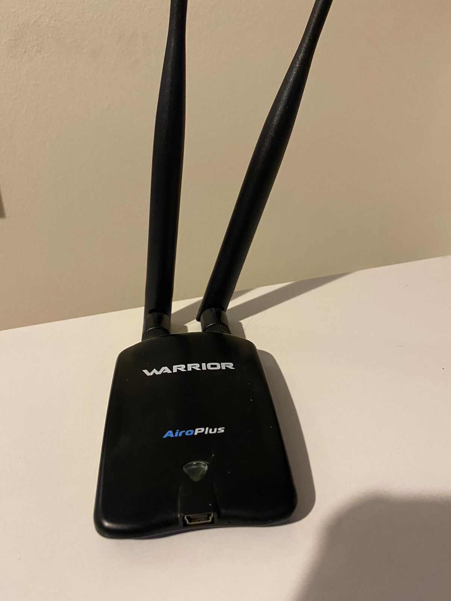

# Airoplus Warrior USB WiFi Dongle WAR-2450-150N and the Mango Pi MQ Pro
This USB WiFi dongle uses the Ralink RT-3070L chipset. This chipset allows me to inject packets in the air for executing e.g. a replay attack.

    

## Objective
I want to connect it to the [Mango Pi MQ-Pro](mangopimqpro.md), in my road to a Mango Pi MQ-Pro cyberdeck. 

## Investigation
For this, I investigated a lot about kernel modules for device drivers and started writing code for the device. Little did I know that this would be very difficult considering that I was going to need to talk to the firmware, but it was my only choice because the driver wasn't ported yet (fake, it was but i didn't knew how to look for it). 
## Including the kernel module
While looking into the kernel source, I realized that the RT2x00 modules were indeed in the RISC-V linux kernel source code, but it wasn't enabled by default in [sehraf's d1-riscv-arch-image-builder](https://github.com/sehraf/d1-riscv-arch-image-builder) script. 

So, obviously, I modified the scripts and included the kernel configurations for that. Then, I was able to get the RT2x00 kernel module inside the build. It worked. 

## Outcome
At that point, I was a step close in my road to the Mango Pi MQ-Pro cyberdeck. Now I am able to inject and sniff packets. 

## Next steps
Some next steps are:
- Solder the I/O pins
- Setup the board's WiFi chipset as Access point for controlling it with my phone via http server
- Connecting a suitable battery, lcd pannel and a mini keyboard.

## Outcome: Fried pins
Sadly, I won't be able to do much, as I fried the board while trying to solder the I/O pins. Next time I'll probably use a solder station or ask someone to do it for me.
