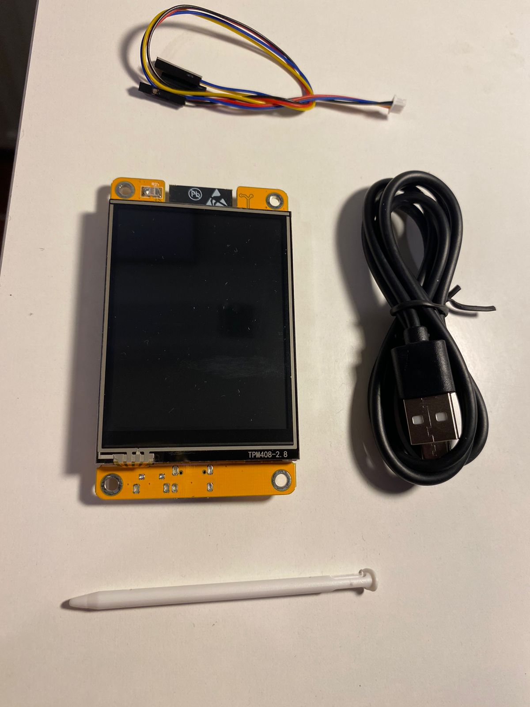
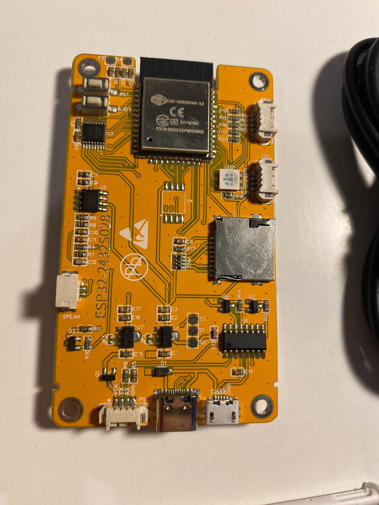
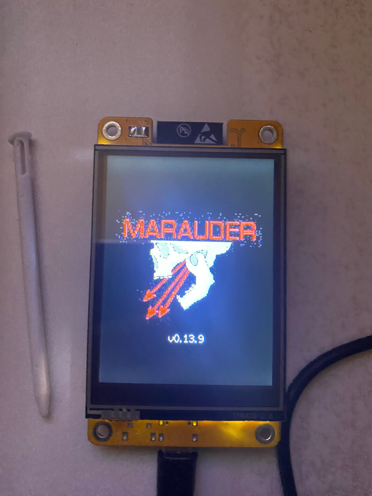

# ESP32 Marauder - Has hacking become too accesible?
Recently, I received an ESP32-WROOM-32 develop module, which I used for a while to play with and test its capabilities. 

## The ESP32 Marauder
Surfing the web, I found justcallmekoko's [ESP32 Marauder](https://github.com/justcallmekoko/ESP32Marauder) project, which is a firmware compiler for a prebuilt device that the author of the project sells, although he also sells the DIY kits and as the code is open source, we can build our own device. 

## What can the ESP32 Marauder do?
- Sniff IEEE802.11 packets, like probes, beacons, deauth packets, handshake.
- Sniff bluetooth devices
- Flood with WiFi and Bluetooth packets
- Cloning and creating arbitrary APs
- Set up an Evil Portal
- Crash iPhones through Sour Apple attack
- etc.
If you are interested on all what can this device can do, visit the [official wiki](https://github.com/justcallmekoko/ESP32Marauder/wiki) or search in youtube for demos.

## Compiling and flashing ESP32 Marauder to a generic ESP32-WROOM-32
I decided to install it in my ESP32 and see how it works. In a few hours I was able to have a functional ESP32 Marauder, but it was a little bit tedious to manipulate, as it needed to be controlled by a serial terminal due to my lack of a TTF display. 

## The cheap ESP32+TTF display
So naturally, it was time for an upgrade. In Aliexpress, I found this [ESP32+TTF display device](https://www.aliexpress.com/item/1005006604267846.html), which I bought for less than two bucks taking advantage of the new account bonus discounts.

    
    

In less than two weeks, I had the cheap ESP32+TTF display in my hands. So it was time to get my hands dirty again and somehow, be able to build a fully functional ESP32 Marauder.

## Compiling and flashing to the ESP32+TTF
### Without help
As I already had look into the code and successfuly modified it to run in my ESP32, I figured out that maybe the best choice was to do the same with the ESP32+TTF. Sadly, I wasn't able to do that, as a lot of errors popped up, errors that trying to fix lead me to no more functionality as the TTY ESP32 Marauder that I first built.

### With repositories
I had to try a different approach. This time, I investigated if someone had already done this, which I knew it was true as someone had commented a picture of his ESP32+TTF running ESP32 Marauder at Aliexpress where I bought the device.

After some little investigation, I found a GitHub repository that was just that, a compiler for the code that someone had successfully built the project for the cheap ESP32+TTF. It also linked to another repo with step if you wanted to modify the code yourself.
- [Fr4nkFletcher's ESP32-Marauder-Cheap-Yellow-Display](https://github.com/Fr4nkFletcher/ESP32-Marauder-Cheap-Yellow-Display)
- [smoochiee's tutorial](https://github.com/smoochiee/MARAUDER-FOR-CYD---CHEAP-YELLOW-DISPLAY)

I cloned the first and also modified the code by myself before buulding, but both of the approaches led me to the same: I was able to compile but the display appeared just white.

### Web flashing
After breaking my head with all the errors the compilation had, and the failing code I was able to compile, I decided to look for a precompiled image that I could just upload and get it running. As it may look, this is indeed the easyest way to do so. 

Fr4nkFletcher's repo shares a [Web Flasher utility](https://fr4nkfletcher.github.io/Adafruit_WebSerial_ESPTool/) for flashing the device I had. This seemed a little to good to be true, so as I was going to give controll of the TTY devices to my browser, maybe it could escalate privileges from there? I am not sure about this but neither I was about risking my security. As I already have a configured Ubuntu VM, I did the flashing from inside that VM, and bridged the USB port to the VM. 

The only thing that I had to install in my VM was Google Chrome as that browser had the capabilities to flash to USB devices. Maybe I only needed the chromium package, but I didn´t care.

## Outcome
Finally, thanks to the web flasher I was able to flash a functional ESP32 Marauder version to my ESP32+TTF device.

    

## Answering the question - Has hacking become too accessible?
Although this whole blog entry may suggest nowadays hacking is too accesible, don't be fooled and think twice. It is true that hacking has become more and more accessible, in such a way that I was able to get a functional WiFi+BT penetration testing tool for less than two dollars. But this doesn't mean that we have an excess on how accessible this devices are: it hasn't became *too* accessible.
As more and more devices like this are published and people start to get their hands on them, people start talking about them and people start aknowledge the need for more secure technologies and systems. 

This devices take advantage of different _known_ attacks and vulnerabilites. The key word here is _known_ as this devices only make it more accessible to attackers to get their hands on this methods, but a flawed technology is flawed even though people have access to tools for attacking them. The problem is not the accessibility to this tools, the problem are the vulnerabilities and low action on patching this flaws, low action that many times is driven by how may the users feel about the changes (e.g. the obvious solution to radio car key stealing and all its falvours is just using a physical key, but users don't want to use that key, they prefer to use a remote key).

