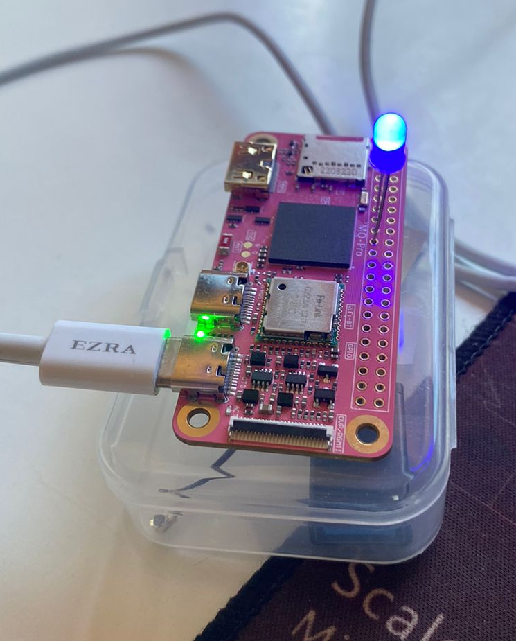
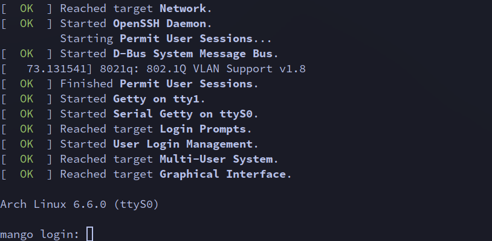

# Mango Pi MQ-Pro
## Buying a RISC V SBC
I recently bought a [Mango Pi MQ-Pro](https://github.com/mangopi-sbc/MQ-Pro).

   

This Single Board Computer (SBC) has the same form factor of a Raspberry Pi Zero, but uses RISC V's ISA and is built with the [Allwinner D1](https://linux-sunxi.org/D1) System on a Chip (SoC). 

## Searching for information
The first thing I did when I got it was to start looking for what to do with it and learn something interesting in the process. So, I began searching for information on the internet and suddenly was faced with a lot of documentation and information on the Mango Pi MQ-Pro. Some examples:
- [sunxi's wiki entry](https://linux-sunxi.org/MangoPi_MQ-Pro)
- [boosterl's awesome-mango-pi-mq-pro repository](https://github.com/boosterl/awesome-mango-pi-mq-pro)

Also found a lot of low-level information and discussion in github written in mandarin, which I didn't even try to translate (maybe for the future).

## How to communicate with the board and operating system
With this new information, I tried to find a way to communicate with the SBC. Initially, I tried with [xfel](https://github.com/xboot/xfel)  but found it painful because it seemed that I didn't want to read/write such low-level data/instructions to RAM or ROM, as I don't understand it that well (although I was able to write information to turn on and off an LED).

   

I opted to use UART and got a 3.3V UART to USB adapter, connecting to the soldered I/O pins as usual.

   

Then, I figured out that to get any UART information through the adapter, I needed something to generate that information. I wondered what if I wrote that information, but suddenly (fake, took me some time) realized that I wasn't going to waste my time writing my own OS, so I downloaded images of various OS, hopped through them distros, and finally found that the best one for this was [Arch Linux](https://archriscv.felixc.at/) (as usual).

Now, with UART, I was able to look at what was happening inside the SBC at a low level but not as low as pure binary. This, plus the Arch Linux installation, enabled me to get a terminal and configure the WiFi and other stuff.

### Build, configure, upload, configure and connect through a terminal
Nowadays, I'm using sehraf’s [d1-riscv-arch-image-builder](https://github.com/sehraf/d1-riscv-arch-image-builder) bash scripts for building and uploading to the micro SD card. I’ve modified it to my needs such that I don't need to configure the OS through getting a terminal (tty) with UART, but it configures all the things I need, including an OpenSSH server for me to connect through my network.

Note the messages of the form "[  OK  ] aaaa." and the form "[   1x.xxxxxx] aaaa[y]: bbbbbb.". The first, from the bootloader, and the second from the kernel (`dmesg`, `journalctl`, etc.). This type of messages help when building a device driver for e.g. an I2C LCD display.

   

Finally, i got a bash shell by logging in. Something i configured was the name of the device:

   

