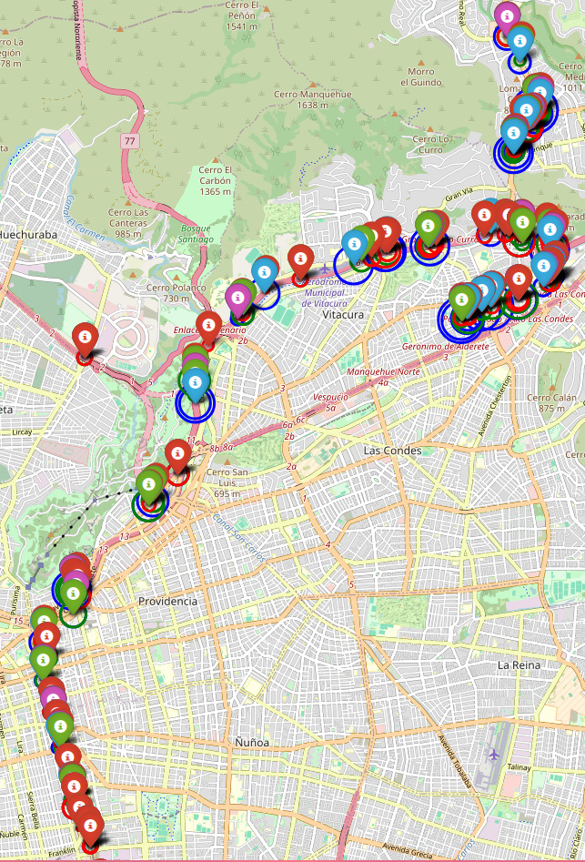

# Moduletest Rabbithole
## Español
Con una Raspberry Pi Zero 2W, una antena USB WiFi 2.4GHz, una powerbank y mi teléfono (como servidor GPS), aproveché algunos viajes para medir señales de ciertos dispositivos de IoT. Estas son las imágenes que me gustaron más.

Cierto comportamiento había llamado mi atención hacia estos dispositivos, y es que estos buscan desesperadamente conectarse a un AP WiFi de nombre (SSID) "moduletest", al orden de cien paquetes por minuto (los paquetes eran probe requests, que combinados con hcxdumptool se puede obtener la PSK cifrada y crackear con hashcat).

Lo curioso fue cuando salí, descubrí cientos de estos dispositivos con este mismo comportamiento, en distintos lugares. Así que me puse a investigar.

¿La teoría actual? Dispositivos de IoT con alguna versión modificada del firmware de Tuya. Algún desarrollador de las modificaciones ha de haber creído buena idea permitir a cualquiera testear el producto (e.g. en luces led es típico un test que pasa por 4 colores RGBW de 0 a 255 para que el usuario/operador pueda verificar que el dispositivo está funcionando correctamente) Lo cierto es que en versiones oficiales del firmware de Tuya, el momento en el que uno puede gatillar los tests es antes de los primeros 500ms ⏱️, no en cualquier momento por alguien que esté cerca del dispositivo (como sí ocurre en el firmware modificado), en especial no queremos gatillar el test en pleno funcionamiento del dispositivo, o podría denegarse el servicio.

Se puede levantar un AP del mismo nombre "moduletest" e interactuar con los dispositivos, responsivos en el puerto 6668 como se sugiere en [1], de modo que, si tuviera uno de estos podría hacer dump del firmware, facilitando el crafteo de un payload.

A pesar de todo esto ¡todavía no logro pararme frente a uno de estos dispositivos! Parece que tendré que hacerme con un dron para seguir las señales.

## Imágenes

1. Algunos dispositivos en el mapa

2. Wardriver

3. Donde he capturado las señales más fuertes

4. Dispositivos enviando probe requests a "moduletest" 

## Referencias

[1] https://github.com/jasonacox/tinytuya/discussions/405

## English
With a Raspberry Pi Zero 2W, a 2.4GHz USB WiFi antenna, a power bank, and my phone (as a GPS server), I took advantage of some trips to measure signals from certain IoT devices. Here are the images I liked the most.

I noticed an interesting behavior in these devices: they desperately try to connect to a WiFi AP named "moduletest", sending around a hundred packets per minute (these packets were probe requests, which, when combined with hcxdumptool, can reveal the encrypted PSK and be cracked with hashcat).

What was curious is that when I went out, I discovered hundreds of these devices with the same behavior in different locations. So, I started to investigate.

Current theory? IoT devices with a modified version of Tuya's firmware. A developer of these modifications might have thought it was a good idea to allow anyone to test the product (e.g., in LED lights, it's typical to have a test that cycles through 4 RGBW colors from 0 to 255 so that the user/operator can verify that the device is functioning correctly). However, in official versions of Tuya firmware, the tests can only be triggered within the first 500ms, not at any moment by someone nearby (as happens with the modified firmware), especially not during the device's normal operation, or it might deny service.

You can set up an AP with the same name "moduletest" and interact with the devices, which respond on port 6668 as suggested in [1], so if I had one of these, I could dump the firmware, facilitating the crafting of a payload.

Despite all this, I still haven’t managed to stand in front of one of these devices! Looks like I'll need to get a drone to track the signals.

